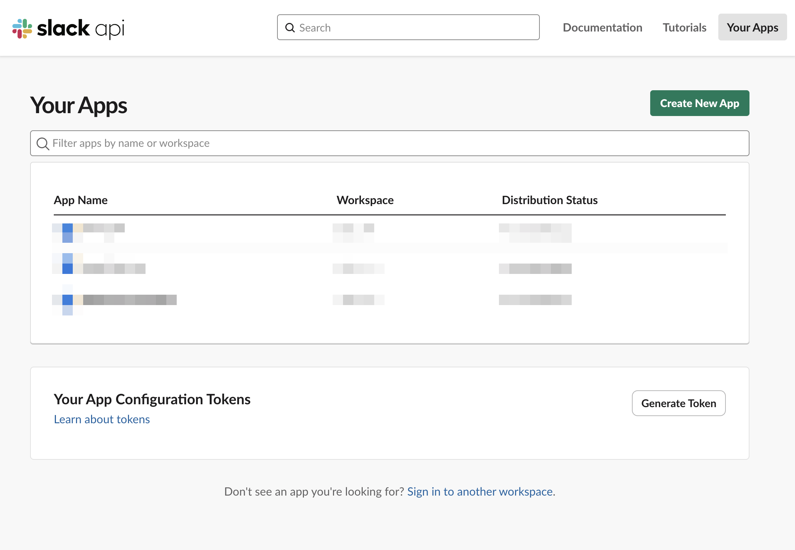
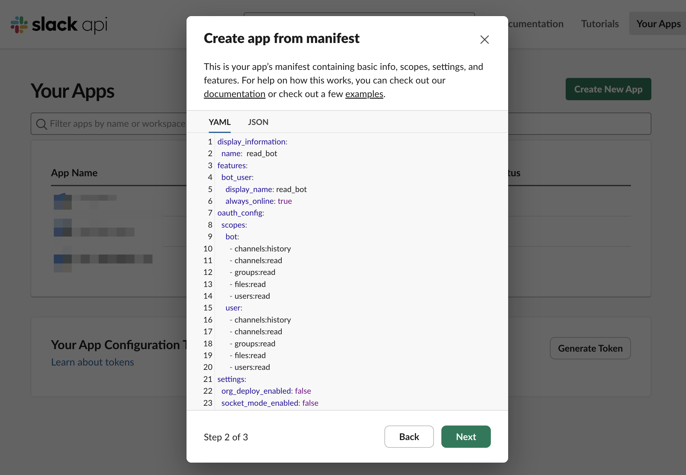
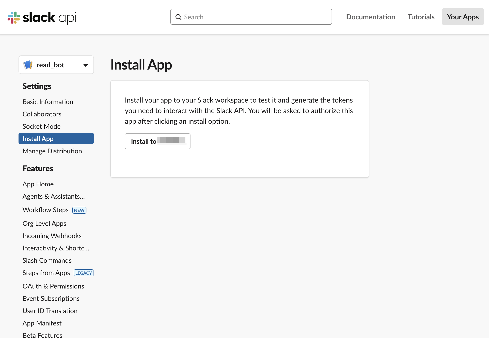
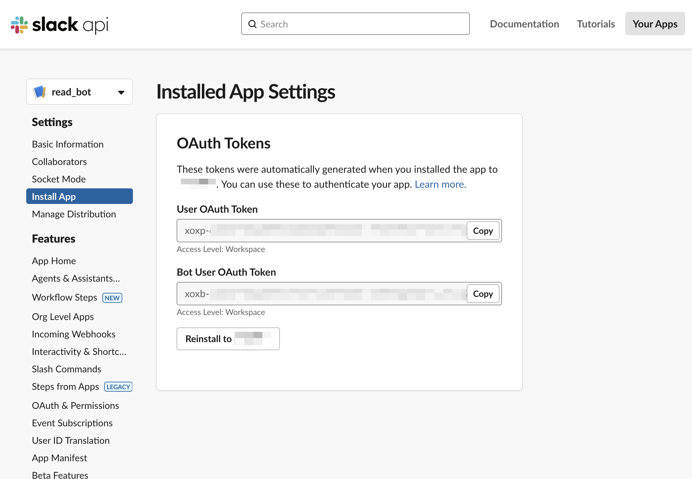
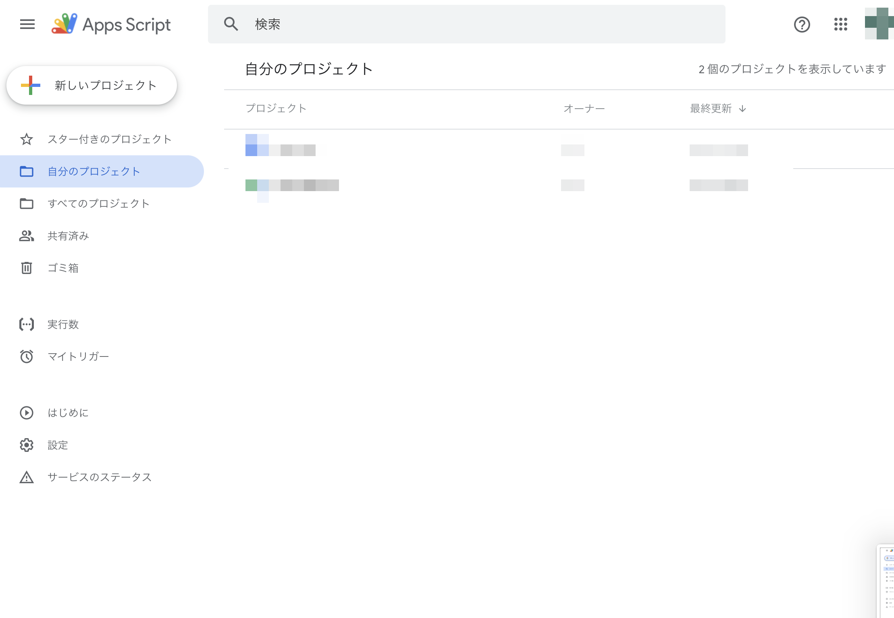
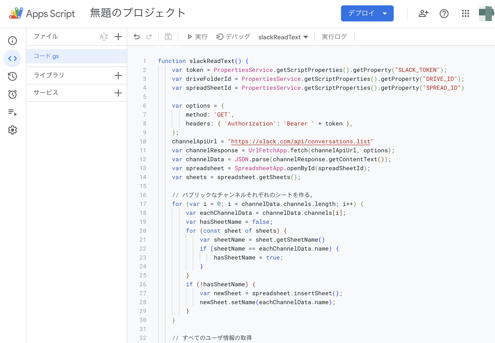
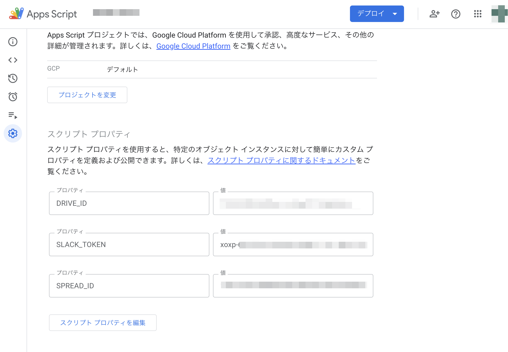
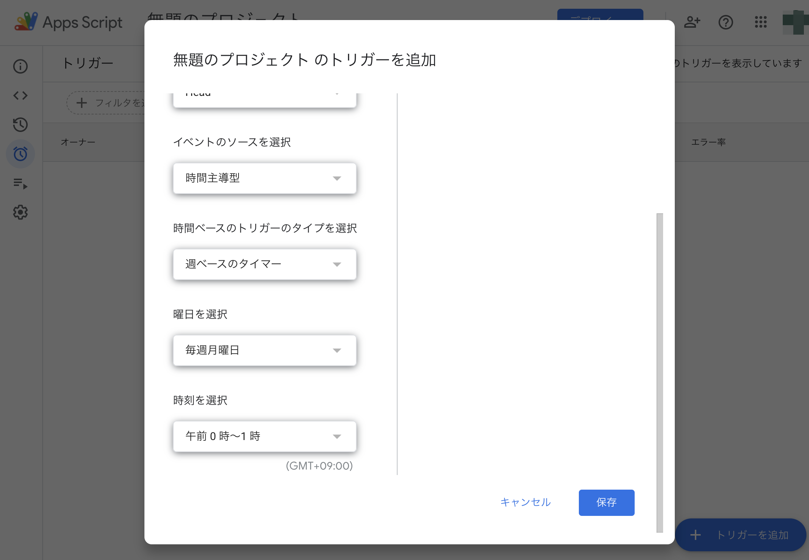
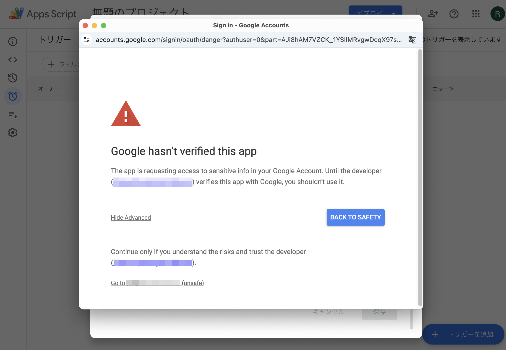

# 目次
- Slackに自作Appを登録。
- Slackからテキストを抽出するためのGASの作成

# Slackに自作Appを登録。

## Appの名前や権限を設定する。

https://api.slack.com/apps を開いて、右上のCreate New Appをクリックする。ここで、Appを登録したいワークスペースにログインしていないならば、先にログインしておく。

次に、From a manifestをクリックし、Appを登録したいワークスペースを選択する。そして、YAMLのマニフェストの内容を以下のように[App_manifest.yaml](App_manifest.yaml)の内容に書き換える。

最後に、Createをクリックする。このマニフェストにより、Appの名前や権限を設定している。

## AppのインストールとOAuth Tokensの取得。

左のタブからInstall Appを選択し、Install to [ワークスペースの名前]をクリックする。

そして、認証が求められるので許可する。これにより、SlackのワークスペースのAppという部分に、Botが追加される。

インストール後に表示される以下のOAuth Tokenはあとで使うことになる。

# Slackからテキストを抽出するためのGASの作成

## GASの新規プロジェクトを作成。

まずブラウザでグーグルアカウントにログインする。そして https://script.google.com/home を開き、左上の新しいプロジェクトをクリックする。

次に、コード.gsの内容を以下のように[slack-read-txt.js](slack-read-txt.js)の内容に書き換える。

このコードでは、SlackからUSERが閲覧可能なグローバルチャンネルのすべてのテキストとファイルを抽出し、それらをグーグルスプレッドシートとグーグルドライブのフォルダに保存するという処理を行っている。

## TOKENやIDの設定

まず、Slackのテキストの保存先のグーグルスプレッドシートとグーグルドライブのフォルダは新規作成しておく。

左のタブからプロジェクトの設定を選択し、以下のように、最下部のスクリプトプロパティに、SLACK_TOKEN、DRIVE_ID、SPREAD_IDを設定する。

ここで、
- SLACK_TOKEN: 先ほど取得したUser OAuth Token
- DRIVE_ID: 保存先であるグーグルドライブのフォルダのURLの一部。具体的には以下のfolders/の後の[ここが必要]の部分。

  https://drive.google.com/drive/u/0/folders/[ここが必要]
- SPREAD_ID: 保存先であるグーグルスプレッドシートのフォルダのURLの一部。具体的には以下のd/の後の[ここが必要]の部分。

  https://docs.google.com/spreadsheets/d/[ここが必要]/edit?gid=0#gid=0

である。

## トリガーの設定

左のタブからプロジェクトの設定を選択し、右下のトリガーを追加をクリックする。
そして、例えば、以下のように時間ベースのトリガーのタイプを選択を変更し、毎週月曜に一回このGASのプログラムを実行させるという設定をする。そして保存をクリックする。

## GASのプログラム初回実行時の認証
初回時だけ、グーグルスプレッドシートとグーグルドライブを操作するための認証が必要。

まず、グーグルアカウントを選択する。
そして、以下のように、Advancedをクリックし、Go to [プロジェクト名] (unsafe)という部分をクリックする。

最後に、グーグルスプレッドシートとグーグルドライブの認証を許可する。

以上より、自動的に一週間に一回Slackからテキストを抽出するプログラムの作成ができた。